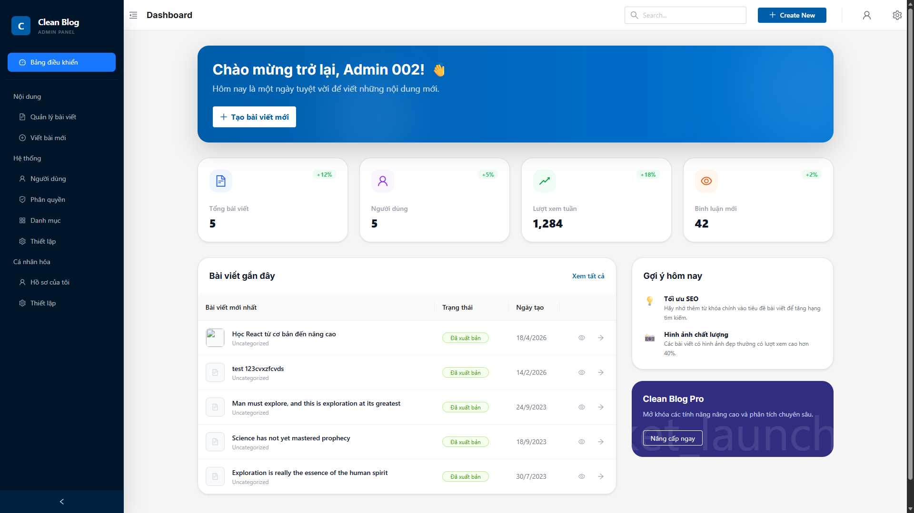
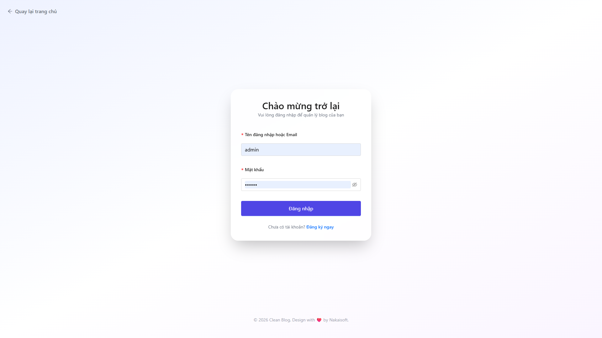
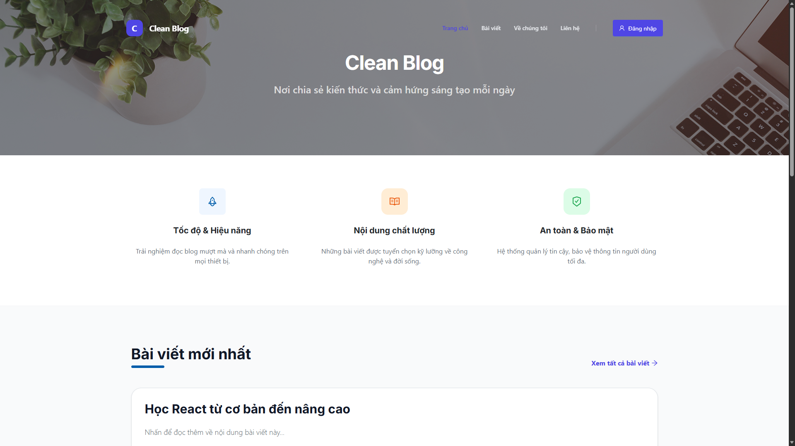

<div align="center">
  <h1>🧠 Clean Blog FS</h1>
  
  <p><strong>Hệ thống quản lý bài viết Full-Stack tích hợp AI, RBAC & Phân quyền thông minh</strong></p>

  <p>
    
    
    
    
    
    
  </p>
</div>

---

## 📋 Tổng Quan Dự Án

Clean Blog FS là một dự án quản lý nội dung bài viết toàn diện, được xây dựng với mục tiêu thực hành và làm chủ quy trình phát triển từ Frontend đến Backend. Dự án áp dụng các tiêu chuẩn thiết kế API hiện đại và mô hình bảo mật mạnh mẽ.

* **Trạng thái:** 🟢 Đang phát triển (Đã hoàn thiện phân tích & thiết kế)
* **Mục tiêu học tập & áp dụng:**
    * Làm chủ luồng dữ liệu Frontend ↔ Backend ↔ Database.
    * Thiết kế & Triển khai RESTful API chuẩn mực.
    * Bảo mật với JWT (JSON Web Token) & RBAC (Role-Based Access Control).
    * Đảm bảo tính toàn vẹn dữ liệu với cơ chế Soft Delete.

---

## 🛠 Tech Stack

| Lĩnh vực | Công nghệ sử dụng |
| :--- | :--- |
| **Backend** | NodeJS, Express, MongoDB, Mongoose, TypeScript, JWT, Bcrypt |
| **Frontend** | ReactJS, Vite, TypeScript, TailwindCSS, Ant Design, Fetch API |
| **Architecture** | RESTful API, RBAC, Soft Delete, Mongoose Population |

---

## ✨ Chức Năng Nổi Bật

* 🔐 **Xác thực & Phân quyền (RBAC):** Đăng ký/Đăng nhập an toàn bằng Bcrypt, quản lý phiên bằng JWT Bearer Token. Phân quyền truy cập linh hoạt theo vai trò.
* 📝 **Quản lý Bài viết (Post):** Hỗ trợ CRUD đầy đủ, tự động tạo URL-friendly Slug, phân trang dữ liệu hiệu quả và bảo vệ dữ liệu với Soft Delete.
* 📂 **Quản lý Danh mục (Category):** Tổ chức bài viết theo danh mục, kiểm soát truy cập và liên kết dữ liệu logic.
* 👥 **Quản lý Người dùng (User & Role):** Theo dõi danh sách người dùng, cấp phát và thu hồi quyền hạn.
* 🔍 **Tìm kiếm & Lọc (Search/Filter):** Hệ thống query dữ liệu mạnh mẽ, kết hợp Populate Mongoose để tối ưu Response chuẩn.

---

## 🏛 Kiến Trúc & Cấu Trúc

### 1. Database Collections
`Users` | `Roles` | `Posts` | `Categories` | `Settings`

### 2. API Endpoints Format
Tất cả các API đều trả về format chuẩn hóa để Frontend dễ dàng xử lý:
```json
{
  "code": 200,
  "message": "Success",
  "data": { ... }
}
```

### 3. Cấu Trúc Thư Mục
```text
clean-blog-fs/
├── ai-agent/         # 🤖 Cấu hình & Kiến thức cho AI Agent
├── documents/        # 📚 Tài liệu phân tích & thiết kế (Yêu cầu, DB, API, UI, Flow)
├── backend/          # ⚙️ Môi trường Node.js & Express API
│   ├── api/v1/       # Định tuyến (Routes) & Logic điều khiển (Controllers)
│   ├── config/       # Cấu hình Database & Hệ thống
│   └── helpers/      # Các hàm tiện ích dùng chung
├── frontend/         # 🎨 Giao diện người dùng ReactJS + Vite
│   └── src/          
│       ├── components/ # UI Components có thể tái sử dụng
│       ├── pages/      # Các trang chính (Admin, Client, Auth)
│       └── services/   # Tích hợp API Fetch/Axios
└── README.md
```

---

## 🚀 Hướng Dẫn Cài Đặt & Chạy Dự Án

### Yêu cầu hệ thống
* Node.js (phiên bản 16.x trở lên)
* MongoDB (Chạy local hoặc qua MongoDB Atlas)

### Bước 1: Cài đặt Dependencies
Mở 2 cửa sổ terminal riêng biệt cho Frontend và Backend:

```bash
# Terminal 1: Backend
cd clean-blog-fs/backend
npm install

# Terminal 2: Frontend
cd clean-blog-fs/frontend
npm install
```

### Bước 2: Cấu hình Môi Trường (.env)
Tạo file `.env` trong thư mục `backend` và khai báo:
```env
PORT=3002
MONGODB_URI=mongodb://localhost:27017/clean_blog_fs
JWT_SECRET=your_jwt_secret_key_here
```

### Bước 3: Khởi động 
* **Backend:** Chạy lệnh `npm start` tại thư mục `backend` (API chạy tại `http://localhost:3002`).
* **Frontend:** Chạy lệnh `npm start` tại thư mục `frontend` (Giao diện chạy tại `http://localhost:3000`).

*(Lưu ý: Đảm bảo MongoDB của bạn đã được khởi động trước khi chạy Backend)*

---

## 📖 Quy Tắc & Tiêu Chuẩn Mở Rộng (Workflow)

Để đảm bảo tính nhất quán của mã nguồn trong suốt quá trình phát triển, dự án áp dụng các quy tắc sau:

1.  **Quy chuẩn Đặt tên:** `camelCase` cho biến/hàm, `PascalCase` cho React Components, `kebab-case` cho URL/Slug.
2.  **Nguyên tắc "Soft Delete":** ⭐ Mọi thao tác xóa đều chỉ cập nhật trạng thái `deleted: true`. Tuyệt đối không xóa vật lý (No physical deletion) để đảm bảo khả năng phục hồi.
3.  **Bảo mật:** Yêu cầu `Authorization: Bearer <token>` header cho các API cần bảo vệ.
4.  **Quy trình Code (Workflow):** Đọc tài liệu `/documents` ➔ Xác nhận Thiết kế DB & API ➔ Triển khai Backend ➔ Xây dựng UI ➔ Kiểm thử JWT & Soft Delete.

---

## 📸 Giao Diện Trực Quan

<details>
<summary><b>1. Trang quản trị (Admin Dashboard)</b></summary>
<br>
Trang dashboard chính dành cho Admin với thống kê bài viết, người dùng, lượt xem và bình luận.

</details>

<details>
<summary><b>2. Trang đăng nhập (Login Page)</b></summary>
<br>
Trang đăng nhập với form xác thực Email và Password an toàn.

</details>

<details>
<summary><b>3. Trang chủ (Home Page)</b></summary>
<br>
Trang chủ cho người dùng thông thường với danh sách bài viết mới nhất.

</details>

---
<div align="center">
  <i>Cập nhật lần cuối: 25-04-2026</i>
</div>
